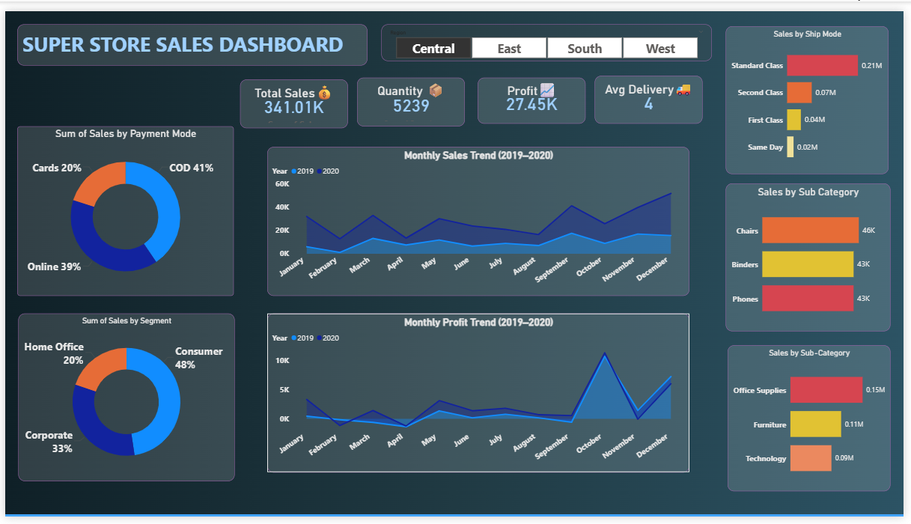
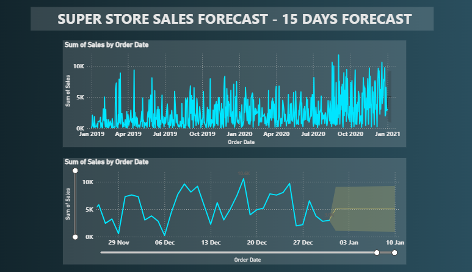

# Superstore Sales Power BI Dashboard

Power BI dashboard for analyzing Superstore sales data and forecasting future sales trends.

## Dashboard Preview

### Main Sales Dashboard

### 15-Day Sales Forecast

## Features
- Sales analysis by region, category, and segment
- Shipping mode and payment mode insights
- Monthly sales and profit trends
- 15-day sales forecasting

## Files Included
- SuperStore_Sales_Dashboard_PowerBI.pbix – Power BI dashboard file
- Project_Presentation.pdf – Project presentation

## How to View
1. Download the `.pbix` file
2. Open it in **Microsoft Power BI Desktop**
